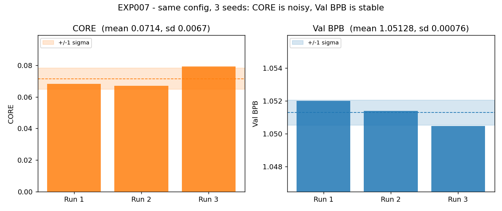
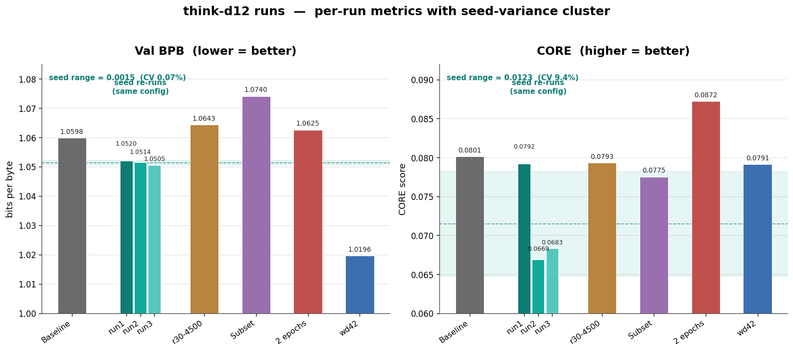
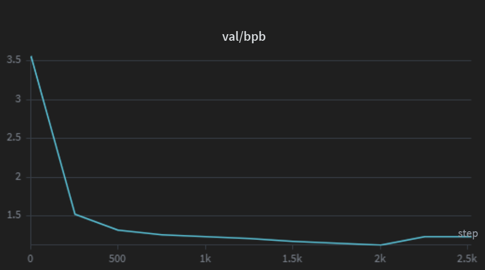
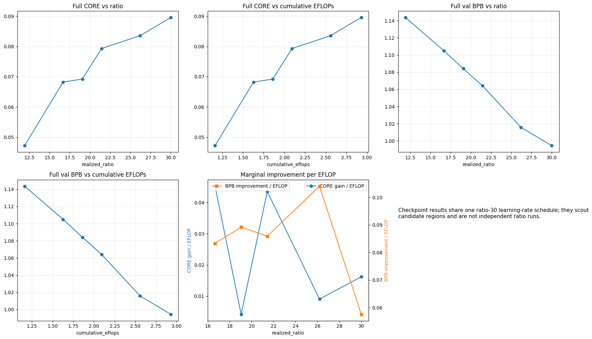
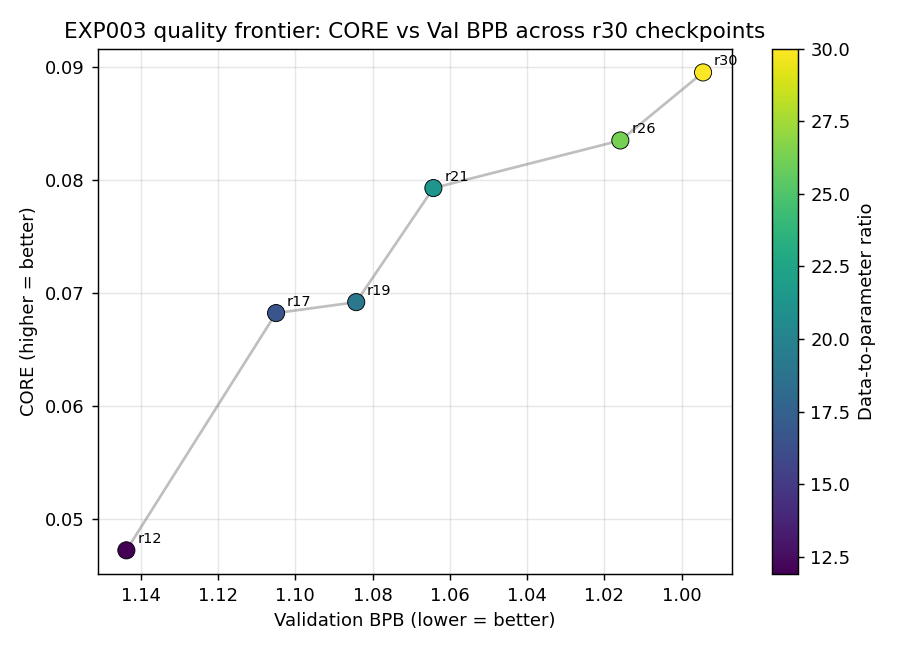

# Think Experiment Log

A running summary of experiments and findings for the Think dataset work.

Experiments mirror the closed issues in [zachnorton14/think.nano](https://github.com/zachnorton14/think.nano/issues?q=is%3Aissue+is%3Aclosed). Ordered by experiment number, most recent number at the top. Result data is pulled from each issue's comments; dates are left as `TBD` where only the close date is known.

A recurring theme across these experiments (made explicit in EXP007): **at the d12 scale, CORE is dominated by seed noise and Val BPB is the reliable metric.** Read the early CORE comparisons with that caveat.

---

## EXP009 — Train on alternate data shards ([#14](https://github.com/zachnorton14/think.nano/issues/14))

*2026-06-17*

A robustness check on the corpus itself: train the same configuration on a different subset (shards) of the Think dataset to see how much dataset quality varies across the corpus.

### Setup
- Run tag: `think-d12-r20-2epoch` (alt-44-shard collection, `think-d12-r20-alt44`)
- Model: d12, r20, same parameters as the original r20-44sh run, different shard subset.

### Goal
See how much the quality of our dataset differs at different subsets of the corpus.

### Results

| Run | CORE | Val BPB |
|---|---:|---:|
| Original r20 (sh472 validation) | 0.0801 | 1.059793 |
| Alt-44 shards | 0.07747 | 1.073976 |

Validation was done on the same shard (472) for both models, so the comparison is apples-to-apples on Val BPB.

The alternate shard collection made the model **worse at autocompleting the validation shard** (Val BPB 1.0740 vs. 1.0598, a ~0.014 gap). So which shards we train on *does* move the validation metric by a non-trivial margin. The CORE drop is noted but not trusted on its own (see EXP007). Practically, this matters less than it looks: larger production models will train on the whole dataset, so shard selection is mostly a small-scale artifact rather than a lasting lever.

---

## EXP007 — Train the same model multiple times ([#12](https://github.com/zachnorton14/think.nano/issues/12))

*2026-06-22*

Repeat one configuration end to end three times, changing only the random seed, to measure run-to-run variance from seeding, sampling, and local minima. This is the experiment that recalibrated how we read every other result.

### Setup
- Run tags: `think-d12-1ep-sh25-r11-run1`, `-run2`, `-run3`
- Model: d12, 25 shards, r11 (~1.2B target tokens using only ~12 of the 25 shards), chosen for speed over r20.
- Required modifying `base_train` to support custom seeding so the runs differ only by seed.

### Goal
Quantify how much the model's results depend on local minima, randomness, and sampling — whether a given CORE result is signal or a one-off.

### Results

| | Run 1 | Run 2 | Run 3 |
|---|---:|---:|---:|
| CORE | 0.068268 | 0.066879 | 0.079172 |
| Val BPB | 1.05198 | 1.05139 | 1.05047 |
| Final Val | 1.10265 | 1.10182 | 1.10162 |

Val BPB across the three seeds: **1.051280 ± 0.000755**.

Two findings, both important:

- **CORE is unreliable at d12.** The same recipe, reseeded, produces CORE from 0.0669 to 0.0792 — a swing wider than the gaps between most *distinct* experiments. CORE cannot rank d12 models.
- **Val BPB is stable.** The same three seeds land within 0.0015 of each other (CV ≈ 0.07%), making it our trustworthy discriminator.

The implication reaches backward: earlier CORE-based conclusions (e.g. EXP004) may have been reading variance. A follow-up note also flagged that re-validating the original r11.25 model gave Val BPB 1.0598 vs. run1's 1.0520 (~0.008 apart, ~11σ) — larger than seed noise should allow, suggesting there is variance *beyond* the RNG and that the "baseline" and the re-runs may not be bit-identical configs despite the label.

---

## EXP006 — r20 model on IB dataset with weight decay 0.42 ([#6](https://github.com/zachnorton14/think.nano/issues/6))

*2026-06-26*

Tests whether more aggressive regularization helps on the lower-quality vintage data. Weight decay raised from the nanochat default 0.28 to 0.42 on an otherwise standard r20 IB run. This issue also carries the consolidated cross-experiment comparison and the seed-variance analysis.

### Setup
- Run tag: `think-d12-1ep-44sh-r20-wd42`
- Model: d12, r20, same training shards as the original IB model
- Weight decay: 0.42 (vs. nanochat default 0.28)

### Goal
Find whether higher weight decay has a significant impact on model performance. Rationale: vintage data is lower quality and less educational than Climbmix, so heavier regularization may help.

### Results

**wd42 r20 run:** CORE 0.0791, Val BPB **1.0196**.
**wd42 r11 run:** Val BPB **?**.

Consolidated comparison across configs (the three baseline re-runs are the seed-variance probe):

| Run | ratio | CORE | Val BPB | Tag |
|---|---:|---:|---|---|
| Baseline | r20 | 0.0801 | 1.0598 | *N/A* |
| Baseline re-run (seed 1) | r11 | 0.0792 | 1.0520 | think-d12-r11.25-run1 |
| Baseline re-run (seed 2) | r11 | 0.0669 | 1.0514 | think-d12-r11.25-run2 |
| Baseline re-run (seed 3) | r11 | 0.0683 | 1.0505 | think-d12-r11.25-run3 |
| r30-4500 | r20 | 0.0793 | 1.0643 | think-d12-1ep-65sh-r30 |
| Subset | r20 | 0.0775 | 1.0740 | think-d12-r20-alt44 |
| 2 epochs | r11 | 0.0872 | 1.0625 | think-d12-r20-2epoch |
| **wd42** | r20 | **0.0791** | **1.0196** | think-d12-1ep-44sh-r20-wd42 |
| **wd42** | r11 | **?** | **?** | think-d12-1ep-25sh-r11-wd42 |

**Seed-variance metrics (3 identical-config re-runs):**

| Metric | Mean | Std (n−1) | Range | CV |
|---|---:|---:|---:|---:|
| CORE | 0.07147 | 0.00673 | 0.01230 | 9.42% |
| Val BPB | 1.05130 | 0.00075 | 0.00150 | 0.07% |

The seed cluster shows CORE's noise band (range 0.0123) is *wider* than the spread between every distinct experiment in the table — so CORE rankings that separate configs by less than ~0.012 are reading noise. Val BPB's band is ~130× tighter in relative terms and cleanly separates real effects.

On Val BPB, **wd42 is the standout: 1.0196, the lowest of any run at similar parameters**, tens of seed-σ below the baseline cluster — far too large to be noise. We can't claim wd42 improves CORE-measured capability (CORE is uninformative at d12), but the Val BPB improvement is real, and Val BPB is our best d12 metric. The only CORE result large enough to maybe trust is the 2-epoch run (0.0872), sitting ~0.6σ above the top of the seed band — weak evidence, worth re-seeding. In order to confirm our hypothesis, we decided to run an r11 run with the weight decay of 42.

### Conclusion

Higher weight decay (0.42) meaningfully improves Val BPB on the vintage data. Adopt it as a candidate default for vintage runs; CORE remains too noisy to corroborate at this scale.

---

## EXP005 — r12 model on an 80% IB / 20% Climbmix dataset ([#7](https://github.com/zachnorton14/think.nano/issues/7))

*2026-06-15*

Isolates *recency* from *quality* as the explanation for the CORE gap between our vintage r12 and nanochat's r12, by blending a little modern data (Climbmix) into the vintage corpus.

### Setup
- Run tag: `ib80climb20-d12-1ep-26sh-r12`
- Model: d12, r12, same training shards as the original model (not all IB shards used)
- Data: 80% IB books + 20% Climbmix, merged via the `merged-data` branch (tokenizer not saved, retrained each run)
- Validation: one validation shard from each dataset, combined at the given ratio

### Goal
Determine whether the CORE-score gap vs. nanochat's r12 is due to the time cutoff (recency) rather than data quality. Hypothesis: if CORE rises a lot while Val BPB barely moves, the gain is content recency, not quality.

### Results

CORE Score: **0.1003** &nbsp;|&nbsp; Val BPB: **1.17**

Per-source validation breakdown:

| Validation source | Val BPB |
|---|---:|
| Combined shard | 1.1702 |
| Climbmix | 1.0073 |
| IB Books | 1.2085 |

CORE jumped ~50% (0.0673 → 0.1003) while combined Val BPB barely moved (1.19 sample → 1.17). That pattern supports the hypothesis: **the CORE gap vs. nanochat is primarily the lack of modern data, not data quality.** Caveat: the run trained on IB books for the first ~2000 steps and only then introduced Climbmix — you can see Val BPB rise around step 2000 — and by then LR decay meant Climbmix was learned at a much lower learning rate. So the result is suggestive, not airtight. (CORE magnitude itself is also subject to the EXP007 noise caveat.)

---

## EXP004 — r12, 2 epochs on the IB dataset ([#5](https://github.com/zachnorton14/think.nano/issues/5))

*Date: 2026-06-19*

Tests reuse vs. fresh data: does training two epochs over a smaller amount of data beat one epoch over more?

### Setup
- Run tag: `think-d12-r20-2epoch` (labeled r20 at init by mistake; this is the r12 / 2-epoch run, d12)
- Model: d12, r12, 2 full epochs. A faulty config led to ~800 extra steps and ~0.4B more tokens than intended.

### Goal
Find whether more epochs over less total data beat a single epoch over more data. Going-in expectation: worse than r20, since fresh data usually beats reuse.

### Results

CORE Score: **0.0872** &nbsp;|&nbsp; Val BPB: **1.106**

At matched step count the 2-epoch model performed **significantly better** than the original 1-epoch r20 — against the prediction. Some of the gain is a scheduler artifact (the longer total-step plan kept the LR higher at the matched step), but the improvement is too large to dismiss. Takeaway: more passes over existing data can match or beat pumping in new unique data; epoch count is a real knob for future configs.

> ⚠️ Revisited by EXP007: the CORE-based part of this win may be inflated by CORE's seed variance. The author later flagged this experiment specifically as one whose CORE findings can no longer be fully trusted. The Val BPB / scheduler reasoning still stands.

---

## EXP003 — r30 model on the IB dataset (ratio scout) ([#4](https://github.com/zachnorton14/think.nano/issues/4))

*Date: 2026-06-19*

Ran a d12 base pretraining run on the Think dataset with a target ratio of 30, then evaluated several intermediate checkpoints to quickly scout whether the best stopping region was closer to r12, r20, r26, or r30.

W&B run: [think-d12-1ep-65sh-r30](https://wandb.ai/jbduran-thinkingmachinesncsu/think.nano/runs/6465e19b/overview?nw=nwuserjbduran)

### Setup
- Run tag: `think-d12-1ep-65sh-r30`
- Checkpoints evaluated: 2500, 3500, 4000, 4500, 5500, 6300
- Metrics: full CORE and full validation BPB

The goal was a cheap scout, not a final scaling law.

### Goal
Find the best data-to-parameter ratio for our model.

### Notes
Caveat: one r30 schedule with frequent checkpoints is not a fair stand-in for independent r12/r16/r20/r26 runs — the LR only warmed up and never decayed for the earlier ratios, so a standalone r15 would beat the r30's checkpoint at the r15 mark.

### Results

| Step | Ratio | EFLOPs | CORE | Val BPB |
|---:|---:|---:|---:|---:|
| 2500 | 11.90 | 1.1627 | 0.04720 | 1.14370 |
| 3500 | 16.67 | 1.6278 | 0.06823 | 1.10496 |
| 4000 | 19.05 | 1.8604 | 0.06920 | 1.08422 |
| 4500 | 21.43 | 2.0929 | 0.07931 | 1.06425 |
| 5500 | 26.19 | 2.5580 | 0.08353 | 1.01587 |
| 6300 | 30.00 | 2.9301 | 0.08956 | 0.99446 |

The results do not support r12 as the right stopping point: Val BPB improved monotonically through r30 and CORE improved overall, so r12 is too low for this dataset/model. But it isn't clean enough to conclude r30 is correct, because all checkpoints come from one r30 LR schedule. CORE is also not the cleanest signal here — the Think corpus is older books while parts of CORE reward modern knowledge; Val BPB is the more direct dataset-fit signal.

### Conclusion

A useful scout, not a definitive scaling-law experiment. Practical takeaway: stick near r20 while the dataset and architecture are still moving — more ratio sweeps now would waste A100 time. Once stable, rerun a cleaner analysis with independent schedules around r16, r20, r24/r26, r30. For now r20 is a conservative, cheaper-than-r30 default near where quality started strengthening.

---

## EXP002 — IB books baseline ([#10](https://github.com/zachnorton14/think.nano/issues/10))

*2026-06-08*

Our second vintage model and the foundation for most later experiments: a nanochat base trained on a new 40B dataset filtered from Institutional Books.

### Setup
- Dataset: [think-dataset](https://huggingface.co/datasets/jbduran/think-dataset) (40B, filtered from Institutional Books by OCR quality, time cutoff 1930)
- Original source: [Institutional Books](https://huggingface.co/papers/2506.08300)
- Ran at both r11.25 (2362 steps; standard for r12 is ~2520) and r20 (4200 steps)

### Goal
Establish a baseline for the vintage IB dataset on the nanochat base.

### Results

| Config | Steps | CORE | Val BPB |
|---|---:|---:|---:|
| r11.25 | 2362 | 0.0673 | 1.098954 |
| r20 | 4200 | 0.0801 | 1.059793 |

This is the reference point for every vintage experiment (EXP003–EXP009). r20 beats r11.25 on both metrics, consistent with the EXP003 scout that r12 is too low a stopping ratio. The r20 numbers (CORE 0.0801 / Val BPB 1.0598) become the "baseline" anchor in EXP006's comparison table — though EXP007 later flagged that this anchor may not be bit-identical to the seed re-runs labeled the same.

---

## EXP001 — r12 model on the Gutenberg dataset ([#8](https://github.com/zachnorton14/think.nano/issues/8))

*2026-05-18*

Our first vintage model: an r12 model on an unfiltered Gutenberg corpus, built on the nanochat foundation.

### Setup
- Dataset: [gutenberg-english-text](https://huggingface.co/datasets/osvoorhe/gutenberg-english-text) (unfiltered)
- Model: [nanochat-gutenberg-d12](https://huggingface.co/osvoorhe/nanochat-gutenberg-d12), d12, r12
- Timeline: 5/29/2026 added pretokenization and first complete run; 6/1/2026 improved data ratio (r4, 8 sequence heads → r12, 24 sequence heads)

### Goal
Get a first vintage model running end to end on the nanochat foundation.

### Results

CORE Score: **0.0549**

Mostly a pipeline-shakeout on raw, unfiltered data, and the lowest CORE of the vintage models. It motivated the move to the filtered Institutional Books corpus in EXP002, where quality could be controlled by OCR filtering and a 1930 time cutoff.

---

## EXP000 — r12 nanochat baseline ([#9](https://github.com/zachnorton14/think.nano/issues/9))

*2026-05-15*

The modern-data control: nanochat at r12 / d12 on Climbmix, giving every vintage experiment a baseline to compare against.

### Setup
- Framework: [nanochat](https://github.com/karpathy/nanochat)
- Dataset: [climbmix-400b-shuffle](https://huggingface.co/datasets/karpathy/climbmix-400b-shuffle)
- Model: d12, r12
- First nanochat run: 5/22/2026

### Goal
Produce a modern-data baseline for comparison against the vintage models.

### Notes
At equal training time the vintage models cannot match this model's performance — the comparison is for orientation, not a fair contest.

### Results

CORE Score: **0.1479**

This is the modern-data CORE ceiling the vintage runs are measured against (0.1479 vs. ~0.05–0.10 for the vintage models). The gap between this and the vintage r12 is exactly what EXP005 attributes largely to data *recency* rather than quality — its 80/20 blend recovered CORE to 0.1003, roughly two-thirds of the way back.
